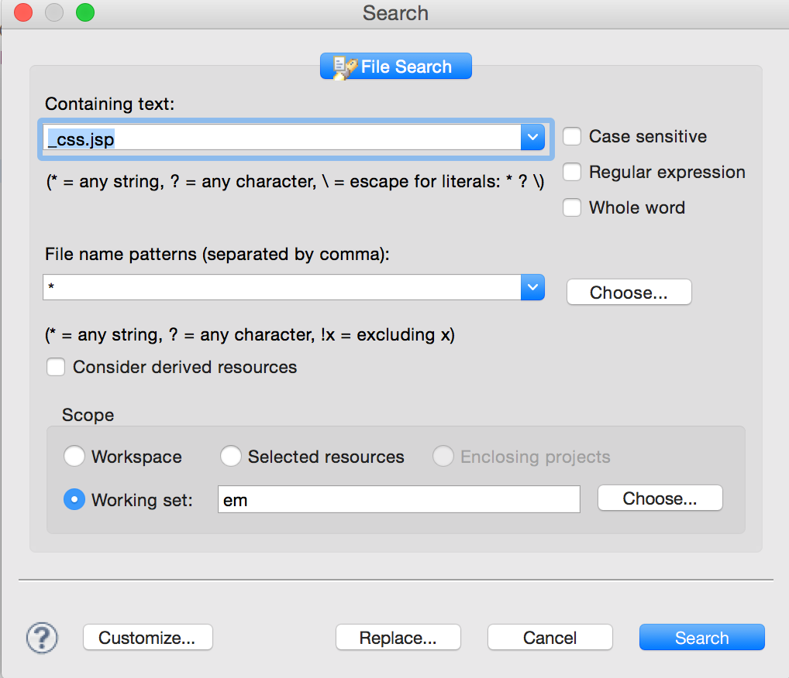
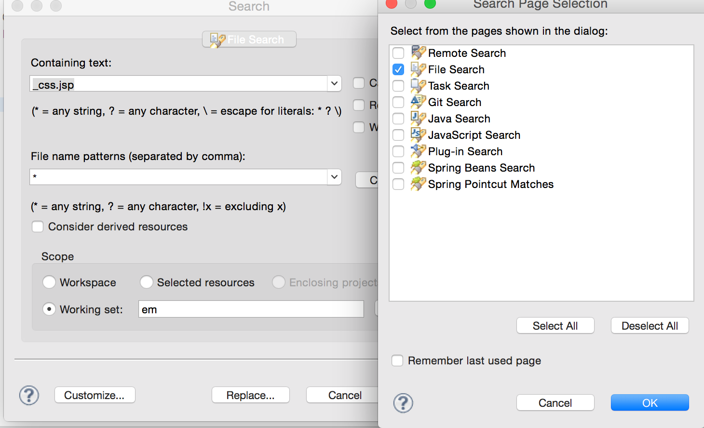
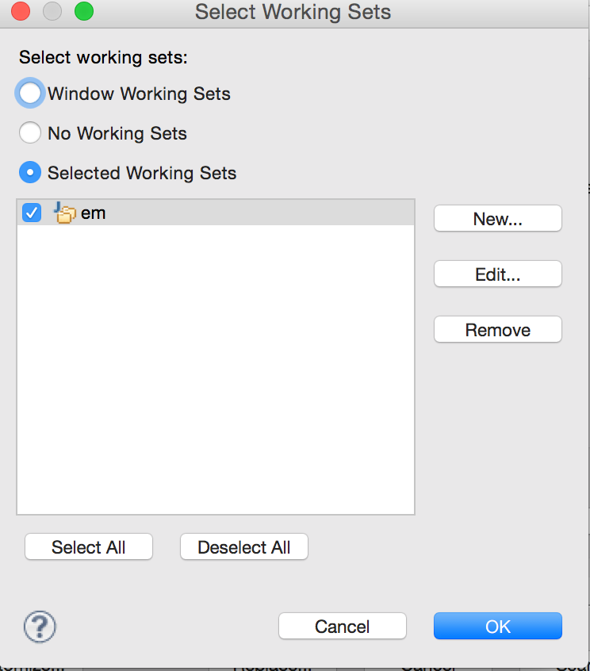
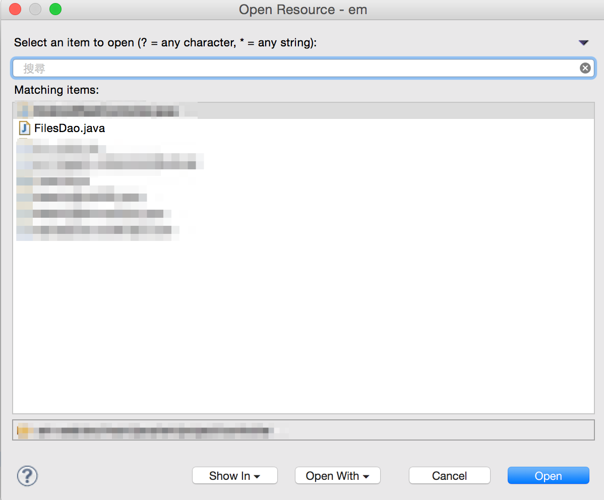
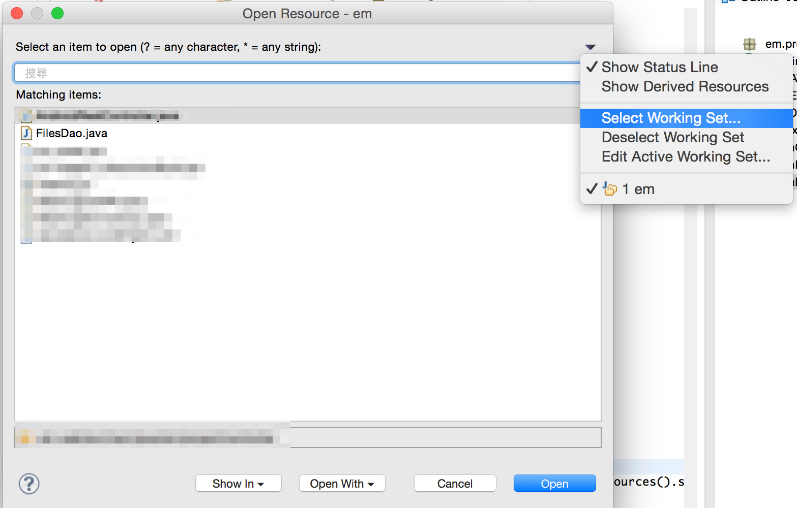
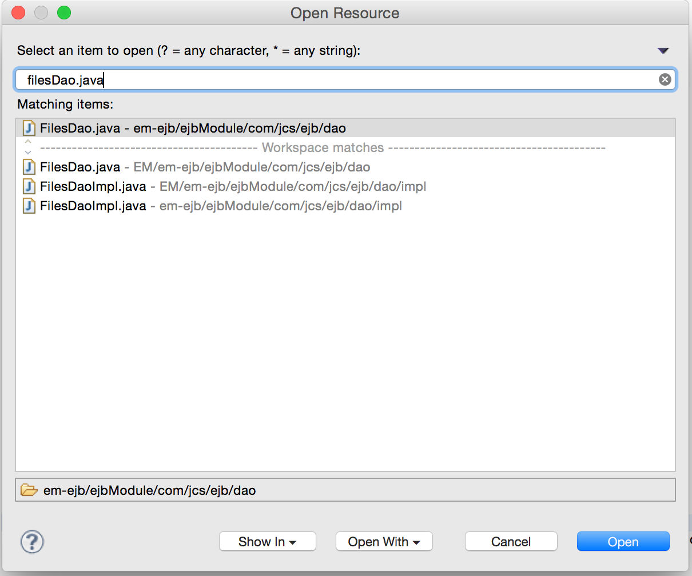
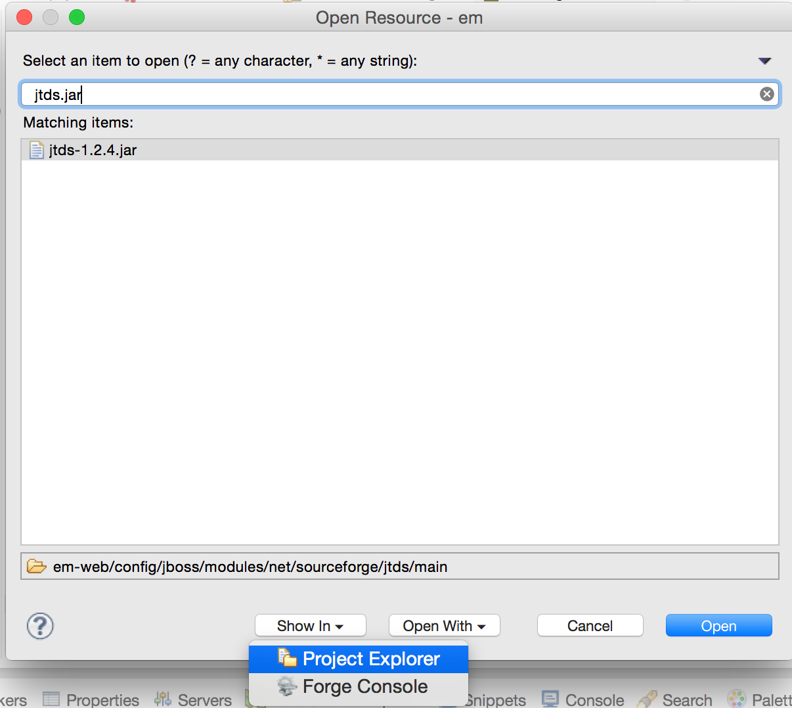

# Eclipse search Tips

Ctrl + H 搜尋

按左下角的Custimize，可以只選出自己想要的搜尋項目。

而 scope 的 working set 可以決定搜尋的目錄範圍。

同樣的，在搜尋檔名的時候也可以這樣做。

可以透過右上角的箭頭，決定要搜尋檔名的working set 。

通常從 Maven import 進來，有分 Module 的專案通常都會造成複數的搜尋結果。

而下方的 show in 則可以選擇只是要看檔案的所在位置，不然一般的預設都是開啟檔案。

當需要搜尋 Jar 檔的位置，但沒有要把他開啟就可以使用此功能。

## 參考資源
- [Eclipse search Tips](http://www.mastertheboss.com/eclipse/jboss-eclipse/eclipse-search-tips)